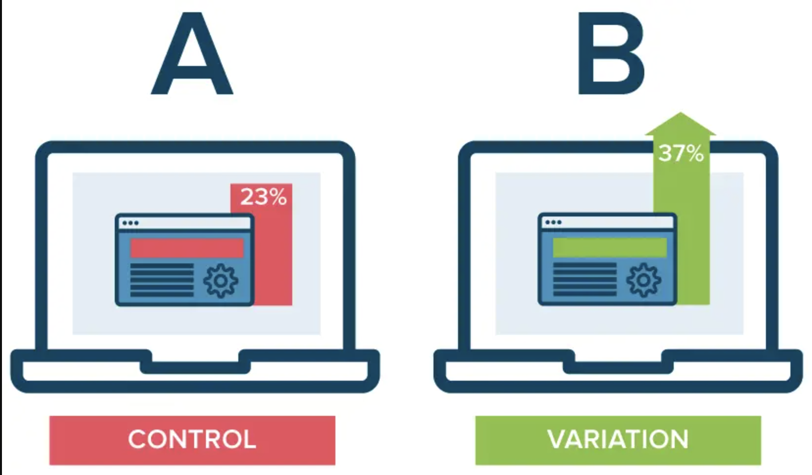

# Marketing-AB-Testing

This project involves the analysis of a marketing dataset using A/B testing to evaluate the effectiveness of marketing strategies. The primary objective is to determine whether specific changes in the marketing approach lead to statistically significant differences in conversion rates and overall performance metrics.

## What is A/B Testing?

A/B testing, also known as split testing, is a statistical method used to compare two versions of a variable (A and B) to determine which one performs better. It is widely used in marketing, product development, user experience (UX) design, and other fields to make data-driven decisions.

### Why A/B Testing is Important?
* **Data-Driven Decision:**  A/B testing allows decisions to be made based on data rather than intuition or guesswork, reducing the risk of making changes that could negatively impact performance.
* **Optimization:** It helps in optimizing websites, ads, emails, and other elements by identifying which variations are more effective at achieving the desired outcome.
* **Understanding User Behavior:**  A/B testing provides insights into how users interact with different versions of a feature, helping to understand their preferences and behavior.
* **Risk Mitigation:** By testing changes on a small portion of your audience before a full rollout, A/B testing reduces the risk of implementing changes that could negatively affect your business.

### Statistical Considerations
- **Significance Level:** The significance level (commonly 0.05) is the threshold for determining whether the observed differences are likely due to the change or just random variation.
- **Sample Size:** A sufficient sample size is crucial for the results to be reliable. Too small a sample size can lead to inconclusive or misleading results.
- **P-Value:** The P-value indicates the probability that the observed differences occurred by chance. A lower P-value (typically < 0.05) suggests that the difference is statistically significant.

#### Additional Resources
[Step by Step Process for Planning an A/B Test](https://towardsdatascience.com/step-by-step-for-planning-an-a-b-test-ef3c93143c0b)

[Practitioner’s Guide to Statistical Tests](https://vkteam.medium.com/practitioners-guide-to-statistical-tests-ed2d580ef04f#1e3b)

## About Dataset 

Dataset: [Kaggle](https://www.kaggle.com/datasets/faviovaz/marketing-ab-testing/data)

* Index: Row index
* user id: User ID (unique)
* test group: If "ad" the person saw the advertisement, if "psa" they only saw the public service announcement
* converted: If a person bought the product then True, else is False
* total ads: Amount of ads seen by person
* most ads day: Day that the person saw the biggest amount of ads
* most ads hour: Hour of day that the person saw the biggest amount of ads

## Analysis Performed

1) Data Exploration and Cleaning
    - Inspected the dataset for missing values, outliers, and inconsistencies.
    - Performed basic exploratory data analysis (EDA) to understand the distribution of key variables.

2) A/B Testing
    - Test Group Analysis: Conducted an independent t-test to compare the conversion rates between the control group (psa) and the test group (ad).
3) Time-Based Analysis
    - Most Ads Day Analysis: Performed ANOVA to assess the impact of different days of the week on ad performance.

        * Result: F-Statistic: 68.39, P-Value: 1.80e-85
        * Conclusion: There is a significant difference in ad performance based on the day of the week.
    - Most Ads Hour Analysis: Conducted ANOVA to analyze the effect of different hours of the day on ad performance.

        * Result: F-Statistic: 18.74, P-Value: 7.48e-77
        * Conclusion: Ad performance varies significantly depending on the hour of the day.
4) Total Ads Analysis
    - Total Ads (Binned) Analysis: Grouped the data based on the total number of ads shown and performed ANOVA to determine if the number of ads shown significantly affects performance.
        * Result: F-Statistic: 1245.67, P-Value: 0.0
        * Conclusion: There is an extremely significant impact of the total number of ads shown on performance, suggesting that ad frequency should be carefully managed.


## Conclusions
The A/B testing and subsequent analyses revealed key insights into how different factors such as the test group, day of the week, hour of the day, and total number of ads shown influence marketing performance. The findings suggest that targeted adjustments in marketing strategy can lead to improved conversion rates and overall effectiveness

### Environment


```BASH
pyenv local 3.11.3
python -m venv .venv
source .venv/bin/activate
pip install --upgrade pip
```